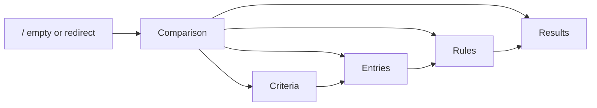

# E2E test plan

## Goal

Define the full Playwright browser coverage for Compy’s product path: comparison → criteria → entries → rules/weights → results.

E2E should prove **cross-page persistence, navigation, dialogs, and the full ranking path**. Unit/component Vitest already covers isolated UI and scoring — do not re-test every toggle in Playwright.

## Progress tracking

When you implement a scenario group from this plan, **mark that group done in this file** once its Playwright specs exist and the focused e2e run for those scenarios passes. Update the scenario heading (e.g. `### A. Home & shell ✅ done`) and the **Current coverage** bullet so the next session knows what is already shipped. Do not mark a group done from a plan-only change.

## Context

- **Stack:** Next.js (`apps/web`) + NestJS (`apps/api`) + Postgres
- **Harness:** Playwright in [`apps/web/playwright.config.ts`](../../apps/web/playwright.config.ts) — `compy_test` DB, API `3100`, web `3101`
- **Current coverage:** Scenario **A** — [`apps/web/e2e/home.spec.ts`](../../apps/web/e2e/home.spec.ts) (A1–A3), [`apps/web/e2e/navigation.spec.ts`](../../apps/web/e2e/navigation.spec.ts) (A4); API seed/reset in [`apps/web/e2e/helpers/api.ts`](../../apps/web/e2e/helpers/api.ts)
- **No auth / roles / payments** in v1 — omit those scenarios

## Scope principles

- **In scope:** real browser flows against API + DB (create → read → update → delete → rank).
- **Out of scope for Playwright:** pure scoring math, pairwise transitivity internals, Zod edge cases already covered in Vitest — unless they only fail when wired through UI + API.
- **Fixture strategy:** seed a known comparison (Price number, Remote boolean, Rating 1–5, Contract enum, 3 entries) via UI or API helpers in `beforeEach` for deterministic sort/rank assertions.

## Scenario inventory

### A. Home & shell ✅ done

| ID | Scenario | Expected | Status |
| ---- | -------- | -------- | ------ |
| A1 | Empty DB home | Empty state + Create CTA; sidebar “My Comparisons” | ✅ |
| A2 | Home with existing comparisons | `/` redirects to `/comparisons/{firstId}` (then entries) | ✅ |
| A3 | Invalid comparison id | Not-found page | ✅ |
| A4 | Sidebar collapse / mobile shell | App usable; comparisons reachable (smoke) | ✅ |

### B. Comparisons CRUD

| ID | Scenario | Expected |
| ---- | -------- | -------- |
| B1 | Create from empty home CTA | New comparison; land on Entries; built-in **name** column present; appears in sidebar |
| B2 | Create from sidebar “+” | Same as B1 when comparisons already exist |
| B3 | Reject blank / whitespace name | Client validation; dialog stays open |
| B4 | Rename comparison | Header + sidebar update |
| B5 | Delete — name mismatch | Confirm disabled until exact name typed |
| B6 | Delete — exact name | Comparison removed; navigate `/`; remaining or empty state correct |
| B7 | Switch comparisons in sidebar | Correct comparison name + tabs data load |

### C. Navigation / tabs

| ID | Scenario | Expected |
| ---- | -------- | -------- |
| C1 | Default comparison URL | `/comparisons/[id]` → `/entries` |
| C2 | Tab deep-links | Criteria / Entries / Rules / Results URLs work and stay on same comparison |
| C3 | Tab switch preserves comparison | Switching tabs does not change comparison id |

### D. Criteria CRUD

| ID | Scenario | Expected |
| ---- | -------- | -------- |
| D1 | Add comparable **number** | Appears on Criteria + as Entries column |
| D2 | Add comparable **boolean** | Same |
| D3 | Add comparable **rating** (valid min/max) | Same; rating UI on entries |
| D4 | Add comparable **enum** (options) | Same; enum options on entries |
| D5 | Add identity criterion (Comparable off → text) | Identity role; available on entries |
| D6 | Reject invalid rating config (min ≥ max) | Validation error; not created |
| D7 | Reject empty enum options | Validation error; not created |
| D8 | Rename built-in key criterion | Display name changes; still key / not deletable |
| D9 | Delete built-in key | Delete control absent or blocked |
| D10 | Rename custom criterion | Name updates across Criteria / Entries / Rules |
| D11 | Delete custom criterion | Column and cell values gone from Entries; Results updates |

### E. Entries CRUD & table

| ID | Scenario | Expected |
| ---- | -------- | -------- |
| E1 | Add entry with all typed values | Cells render correctly (number, bool, rating `n/max`, enum, text) |
| E2 | Add entry with only required name | Optional cells empty (em dash); allowed |
| E3 | Reject blank entry name | Validation; dialog stays open |
| E4 | Reject invalid number text | Client validation |
| E5 | Edit entry values | Table updates after save |
| E6 | Clear optional value on edit | Cell becomes empty; persists after reload |
| E7 | Delete entry with confirm | Row removed |
| E8 | Sort column asc then desc | Row order changes correctly for known fixture |
| E9 | Empty entries state | Empty CTA / message when no rows |

### F. Rules & weights

| ID | Scenario | Expected |
| ---- | -------- | -------- |
| F1 | Set weights via steppers to sum 100 | Persist after refresh; remaining pool updates |
| F2 | Cannot increase past remaining pool | Stepper blocked at remaining 0 |
| F3 | Cannot decrease below 0 | Stepper blocked |
| F4 | Number/rating rule Higher vs Lower | Rule summary updates; affects Results order |
| F5 | Boolean preferred Yes/No | Same |
| F6 | Enum rule dialog — assign all options via tiers | Save enabled only when complete; summary on Rules |
| F7 | Pairwise questionnaire — 2 criteria | Completing sets 100/0 (or equivalent); weights saved |
| F8 | Pairwise — Cancel | No weight change |
| F9 | Pairwise — Back | Undoes last answer in session |
| F10 | Pairwise disabled with &lt;2 comparable | Control disabled / unavailable |
| F11 | Questionnaire intro warns weights will be replaced | Visible before start |

### G. Results

| ID | Scenario | Expected |
| ---- | -------- | -------- |
| G1 | Fully configured fixture | Ranked order matches expected scores; no config alert |
| G2 | Medals for top scores | Top ranks show medals (ties share appropriately) |
| G3 | Pros/cons highlights | Highlight cells populated for known data |
| G4 | Alert — zero / all-zero weights | Config alert shown; link to Rules |
| G5 | Alert — partial weights (sum ≠ 100) | Alert + Rules link |
| G6 | Alert — unset rules | Alert + Rules link |
| G7 | Alert — missing weighted values | Alert + Entries link |
| G8 | Alert deep-link navigation | Clicking alert link opens correct tab |

### H. i18n

| ID | Scenario | Expected |
| ---- | -------- | -------- |
| H1 | Switch EN → PL | Known chrome string in Polish (e.g. sidebar label) |
| H2 | Switch PL → EN | Chrome back to English |
| H3 | Locale cookie persists | Refresh keeps language |
| H4 | User data names unchanged | Comparison/criterion/entry names not translated |

### I. Resilience / API failure (optional but valuable)

| ID | Scenario | Expected |
| ---- | -------- | -------- |
| I1 | Create comparison when API down | Error in dialog; stay on page |
| I2 | Weight PATCH failure | UI rolls back to previous weight (if feasible to force fail) |

## Suggested Playwright file layout

| File | Scenarios |
| ---- | --------- |
| `e2e/home.spec.ts` | A1–A3 (extend existing) |
| `e2e/comparisons.spec.ts` | B1–B7 |
| `e2e/navigation.spec.ts` | C1–C3, A4 |
| `e2e/criteria.spec.ts` | D1–D11 |
| `e2e/entries.spec.ts` | E1–E9 |
| `e2e/rules.spec.ts` | F1–F11 |
| `e2e/results.spec.ts` | G1–G8 |
| `e2e/i18n.spec.ts` | H1–H4 |
| `e2e/helpers/` | API/UI seed, selectors, locale cookie |

## Priority

- **P0 (ship first):** A1–A2, B1, B6, C1–C2, D1–D5, E1–E2, E8, F1, F4, G1–G2, G4
- **P1:** remaining CRUD, enum rules, questionnaire, alerts, rename/delete criterion
- **P2:** i18n, mobile shell, API failure (I1–I2)

## Out of scope

- Replacing Vitest unit/component tests
- API-only supertest expansion (separate from Playwright)
- Auth, sharing, multi-tenant, or payment flows (not in product)
