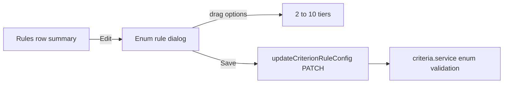

# Enum criterion rule editor

## Goal

Let users set a ranking rule for comparable enum criteria by assigning options to tiers, then persist that rule via the existing `ruleConfig` PATCH path.

## Locked product decisions

- **Rules row:** short summary = one **best** value + one **worst** value, plus an Edit control.
- **Editor:** dialog with **drag-and-drop** of enum options onto tiers (not inline expand).
- **No tier labels** in UI or required schema for now.
- **Default when opening** with missing/invalid `ruleConfig`: **3 empty tiers**. Do **not** seed `ruleConfig` on criterion create.
- **Tier count:** min **2**, max **10**, controlled by **+** / **-** in the dialog.
- **Out of scope:** scoring/ranking engine, incomplete-data warnings, renaming tiers.

## Current gap

Backend already validates and persists enum `ruleConfig` in `apps/api/src/criteria/criteria.service.ts` (all options assigned, no unknowns). Shared schema today is still the old model (`rank` 1–5, required `label`, tiers 1–5) in `packages/shared/src/criterion.ts`. Rules UI falls through to `"—"` in `apps/web/components/rules-data-table.tsx` / `apps/web/lib/format-rule.ts`.

## Implementation order

### 1) Update shared enum rule contract

In `packages/shared/src/criterion.ts`:

- `EnumTierRankSchema`: `int` **1–10**
- `EnumTierSchema`: `{ rank, values }` only — **drop required `label`** (optional later if needed)
- `EnumRuleConfigSchema`: `tiers` **min 2, max 10**; keep unique ranks + values in at most one tier
- Export a small helper for defaults, e.g. `defaultEnumRuleConfig()` → 3 tiers with ranks `1,2,3` and empty `values` (higher rank = better, consistent with existing docs)

Update API fixtures/tests that still send `label` and old 1–5 assumptions in `apps/api/src/criteria/criteria.service.spec.ts`. Add one happy-path “accepts valid enum tiers” case alongside the existing unknown-value rejection.

### 2) Formatters / pure helpers (web)

Extend `apps/web/lib/format-rule.ts`:

- Parse enum `ruleConfig` safely (reuse shared schema or a narrow type guard)
- **Summary:** pick one value from the **highest-rank non-empty** tier (best) and one from the **lowest-rank non-empty** tier (worst). Example: `Best: Diesel · Worst: Petrol`. If no usable assignment → `—`
- Helpers to build dialog draft from `ruleConfig` / options: start from saved tiers or `defaultEnumRuleConfig()`, place unassigned options in an **Unassigned** pool, support add/remove tier (clamp 2–10) and move values between buckets without duplicates

### 3) Enum rule dialog + Rules row wiring

Add `apps/web/components/enum-rule-dialog.tsx`:

- Triggered from the Rules table enum cell
- Layout: **Unassigned** list + ordered tier columns/rows (label ends as Worst / Best with one clear orientation)
- **DnD:** add `@dnd-kit/core` (+ sortable/utilities as needed) to `@compy/web` — no DnD lib in the repo today
- **+ / −** adjust tier count; removing a tier moves its values back to Unassigned
- **Save** enabled only when every criterion option is assigned exactly once; then call existing `onChange` / `applyRule` → `updateCriterionRuleConfig`
- Cancel discards draft

Wire in `apps/web/components/rules-data-table.tsx` `RuleEditor`: for `type === 'enum'`, render summary + dialog instead of `formatRuleMessage` fallback.

### 4) Tests / validation

- Update `apps/web/lib/format-rule.spec.ts` for best/worst summary (and empty → `—`)
- Update `apps/web/components/rules-data-table.spec.tsx`: replace invalid `{ tiers: [] }` fixture; assert enum row shows summary + Edit; exercise save with a valid tier payload (mock `updateCriterionRuleConfig`)
- Focused dialog helper tests if logic lives outside the component
- Run: web vitest for touched files + api `criteria.service.spec`

## Implementation checklist

- [ ] Widen enum rule schema to 2–10 unlabeled tiers (rank 1–10) + `defaultEnumRuleConfig` helper; fix API specs
- [ ] Add best/worst `formatRuleMessage` + draft/unassigned/move/add-remove tier helpers
- [ ] Build `EnumRuleDialog` with `@dnd-kit`, +/− tiers, Save when fully assigned
- [ ] Wire enum `RuleEditor` in `rules-data-table` to summary + dialog
- [ ] Update format-rule, rules-data-table, and API criteria tests; run focused vitest/jest
