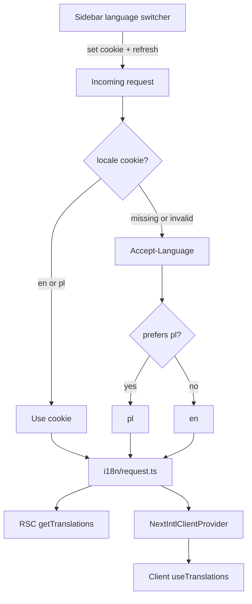

# Internationalization (UI chrome)

## Goal

Let users use Compy in **English** or **Polish**. UI chrome (buttons, tabs, dialogs, empty states, aria-labels) comes from message catalogs. URLs, user-entered data, and API/Zod errors stay as they are today.

There is no User model, so language cannot live on a profile. Preference is a **cookie** plus an explicit **switcher**.

## Locked product decisions

- **Locales:** `en` (default) and `pl`. One JSON catalog per locale so a later language is “add locale + catalog,” not a refactor.
- **What is translated:** UI chrome only — buttons, tabs, dialogs, empty states, aria-labels, page blurbs, metadata description, visible shadcn a11y strings (`Toggle Sidebar`, `Close`). Client **fallback** errors in [`apps/web/lib/actions.ts`](../../apps/web/lib/actions.ts) (`Failed to create comparison`, and the fallbacks passed to `readApiErrorMessage`). Client validation copy in [`apps/web/lib/create-entry.ts`](../../apps/web/lib/create-entry.ts) (`Name is required`, typed-field messages).
- **What is not translated:** user/instance data (comparison titles, criterion names, enum options, entry values); Nest / `@compy/shared` Zod issue strings; raw API `message` values forwarded by `readApiErrorMessage`; route path segments (`/comparisons/.../rules`).
- **Built-in criterion:** at comparison create the web app sends a locale-based default key criterion name (`name` for `en`, `nazwa` for `pl`). The API accepts optional `keyCriterionName` and falls back to `"name"`. That value is stored as data. Switching language does not rename existing columns.
- **How language is chosen:** cookie + switcher. **No** `/pl` prefix, **no** `[locale]` route move.
  - Cookie present and equal to `en` or `pl` → use it
  - Else `Accept-Language` → `pl` if Polish is preferred, otherwise `en`
  - Invalid cookie values are ignored (fall through to `Accept-Language`)
  - The cookie is written only when the user picks a language in the switcher (long-lived). That overrides the browser on later requests.
- **Switcher:** compact control in the unused `SidebarFooter` of [`app-sidebar.tsx`](../../apps/web/components/app-sidebar.tsx). Labels in the language’s own name (`English` / `Polski`). Same control in the collapsed and mobile sidebar.
- **`html lang`:** follows the active locale.
- **Fonts:** add `latin-ext` to Noto Sans and Playfair Display in [`apps/web/app/layout.tsx`](../../apps/web/app/layout.tsx) so Polish diacritics render.

## Locale resolution



## Current gap

The web app is English-only hardcoded copy. [`apps/web/app/layout.tsx`](../../apps/web/app/layout.tsx) sets `lang="en"`. There is no middleware, no i18n library, and no settings page. Copy lives inline in ~15–20 feature files plus helpers (`format-rule.ts`, `actions.ts`, `create-entry.ts`).

## Locked technical decisions

**Library:** [`next-intl`](https://next-intl.dev/docs/getting-started/app-router/without-i18n-routing) **without i18n routing**. Keep existing pathnames.

- Plugin in [`apps/web/next.config.ts`](../../apps/web/next.config.ts)
- [`apps/web/i18n/request.ts`](../../apps/web/i18n/request.ts) reads cookie / `Accept-Language`, loads `messages/{locale}.json`
- Locale constants + cookie name in a small web-only module (e.g. [`apps/web/i18n/config.ts`](../../apps/web/i18n/config.ts)): `locales = ['en', 'pl']`, `defaultLocale = 'en'`, cookie `locale`
- [`NextIntlClientProvider`](https://next-intl.dev/docs/getting-started/app-router/without-i18n-routing) in the root layout for client dialogs
- Server components: `getTranslations`; client: `useTranslations`
- Typed messages (`next-intl` plugin) so missing keys fail at compile time

Do **not** add `next-intl` (or any UI i18n lib) to [`packages/shared`](../../packages/shared). That package stays Zod + pure helpers.

**Message layout:** nested JSON by screen/feature, ICU interpolation. Keep `en.json` and `pl.json` key-identical. Examples:

- `sidebar.myComparisons`
- `tabs.rules`
- `weightQuestionnaire.question` — `What is more important to you?`
- `weightQuestionnaire.progress` — `Question {n}`
- `rules.enumSummary` — `Best: {best} · Worst: {worst}`

Adding a locale later: add the code to `locales`, copy `en.json` → `{locale}.json`, translate.

**Cookie:** name `locale`, values `en` | `pl`, long `maxAge` (about one year). Switcher sets it and calls `router.refresh()`.

**Pure helpers vs copy:** [`apps/web/lib/format-rule.ts`](../../apps/web/lib/format-rule.ts) currently returns English (`Higher is better`, `Best: …`). Change `formatRuleMessage` / `formatEnumRuleSummary` to return **message ids + values**. Components call `t`. Unit tests assert keys/values, not English sentences.

```ts
type RuleMessage =
  | { id: 'rules.emDash' }
  | { id: 'rules.higherIsBetter' }
  | { id: 'rules.lowerIsBetter' }
  | { id: 'rules.yesIsBetter' }
  | { id: 'rules.noIsBetter' }
  | { id: 'rules.enumSummary'; values: { best: string; worst: string } };
```

`emDash` is the existing `'—'` empty summary (a catalog string, so Polish can keep an em dash or substitute).

**Errors:**

| Source | Translate? |
| ------ | ---------- |
| Hardcoded fallbacks in `actions.ts` / `create-entry.ts` | Yes (chrome) |
| Zod `issues[0].message` from `@compy/shared` | No |
| API body `message` via `readApiErrorMessage` | No |

## Implementation

### 1) Plumbing

- Add `next-intl` to `@compy/web`
- `apps/web/i18n/config.ts` — locales, default, cookie name
- `apps/web/i18n/request.ts` — cookie → Accept-Language → `en`; load messages
- Wrap [`next.config.ts`](../../apps/web/next.config.ts) with `createNextIntlPlugin`
- `apps/web/messages/en.json` — extract current English copy
- `apps/web/messages/pl.json` — same keys, Polish
- Root layout: `NextIntlClientProvider`, `lang={locale}`, `latin-ext` font subsets

### 2) Switcher

- Client control that writes the `locale` cookie and `router.refresh()`
- Mount in `SidebarFooter` of [`app-sidebar.tsx`](../../apps/web/components/app-sidebar.tsx)
- Usable when the sidebar is collapsed or shown as the mobile sheet

### 3) Replace hardcoded chrome

Feature surfaces (not an exhaustive string list — extract every user-visible chrome string in these files):

- [`app-sidebar.tsx`](../../apps/web/components/app-sidebar.tsx), [`comparison-tabs.tsx`](../../apps/web/components/comparison-tabs.tsx)
- Create/delete dialogs and action menus (comparison, criterion, entry)
- [`rules-data-table.tsx`](../../apps/web/components/rules-data-table.tsx), [`enum-rule-dialog.tsx`](../../apps/web/components/enum-rule-dialog.tsx), [`weight-questionnaire-dialog.tsx`](../../apps/web/components/weight-questionnaire-dialog.tsx)
- [`results-data-table.tsx`](../../apps/web/components/results-data-table.tsx), [`comparison-data-table.tsx`](../../apps/web/components/comparison-data-table.tsx), [`criteria-data-table.tsx`](../../apps/web/components/criteria-data-table.tsx)
- [`entry-value-field.tsx`](../../apps/web/components/entry-value-field.tsx), page blurbs under `app/(app)/comparisons/[id]/`
- [`format-rule.ts`](../../apps/web/lib/format-rule.ts) consumers, `actions.ts` fallbacks, `create-entry.ts` client messages
- shadcn a11y chrome that users hear/see (sidebar toggle, dialog close)

Leave comparison/criterion/entry **names** and enum **option values** as stored.

### 4) Tests

- Small helper that wraps component tests in `NextIntlClientProvider` + the English catalog. Existing Vitest copy assertions stay English.
- Update [`format-rule.spec.ts`](../../apps/web/lib/format-rule.spec.ts) to assert message ids + values.
- Catalog parity: `en.json` and `pl.json` have the same key tree.
- No bilingual Playwright suite (none exists today).

## Implementation checklist

- [ ] Add `next-intl`, locale config, `i18n/request.ts`, plugin, `en`/`pl` catalogs, provider + `lang` + `latin-ext`
- [ ] Locale cookie helper + sidebar language switcher
- [ ] `format-rule` returns message ids + values; components translate
- [ ] Replace hardcoded chrome in feature components, pages, `actions.ts` fallbacks, `create-entry.ts`, shadcn a11y strings
- [ ] Test helper + format-rule specs + catalog key-parity test; run focused web vitest

## Out of scope

- Locale in the URL / translated pathnames
- Translating API, Zod, or Nest exception strings (no error-code map in v1)
- Translating user data or the built-in `"name"` column
- User accounts / persisted profile locale
- Dates/currency formatting (almost unused in UI)
- Translation management SaaS, RTL, more than `en`/`pl` catalogs
- Changing comparison/criterion/entry JSON contracts
- Adding `next-intl` to `@compy/shared` or the API
