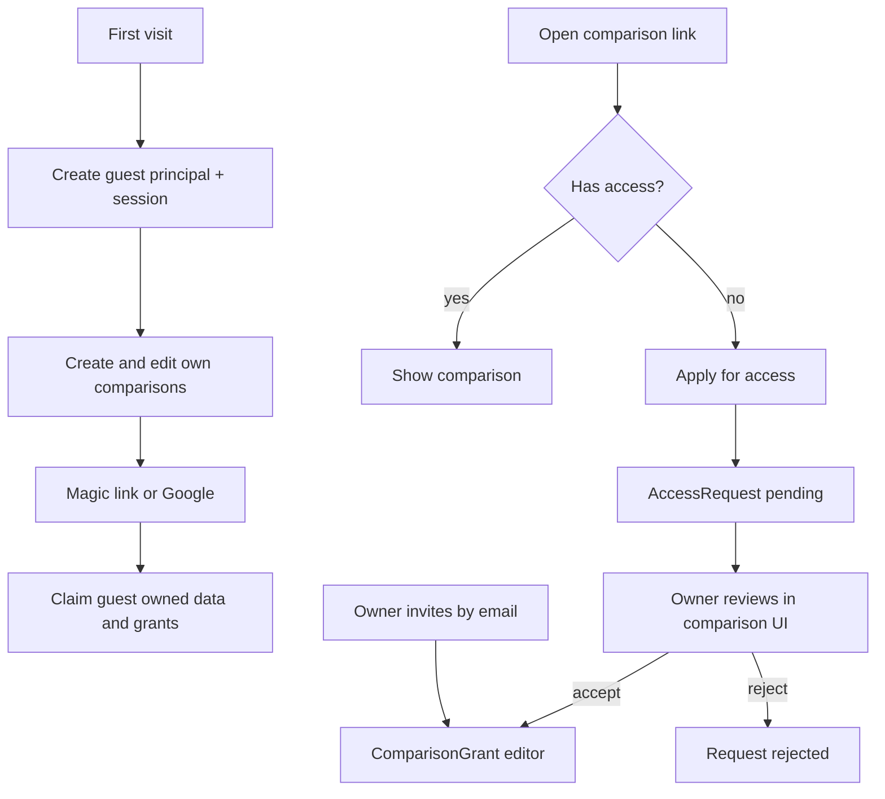

# Ownership, auth & access

## Goal

Every comparison has **one owner**. The app is usable **without mandatory registration** (guest principal). Users can **sign up** to keep data across devices and beyond guest retention. Comparisons are **private by default**: no access means no data. Owners share via **email invite** (registered users) or a **link** that does not grant access by itself—recipients **apply**, and the owner **accepts or rejects**.

This replaces today’s globally open instance (no `User`, open `GET /comparisons`).

## Locked product decisions

1. **One owner** per comparison (`ownerId` → principal).
2. **Principal kinds:** `guest` (temporary) or `registered`.
3. **Guest:** created on first visit. Prefer identity via **httpOnly, Secure, SameSite session cookie** (not raw localStorage). If client-stored ID is used instead, treat it as a bearer secret.
4. **Registered auth (passwordless):** email **magic link** + **Google OAuth**. No passwords.
5. **Retention:**
   - Registered-owned comparisons → kept until **account deletion**
   - Guest-owned comparisons → hard-deleted after **14 days of inactivity** (`lastActiveAt` touched on access by owner or grantee)
6. **Visibility:** list and detail only if caller is **owner** or has an accepted **`ComparisonGrant`**. Knowing `publicId` alone does **not** return comparison payload.
7. **Sharing:**
   - Owner invites an **existing registered user by email** → immediate grant
   - Invite to unknown email → reject / “ask them to sign up first” (no pending invites to future accounts in this phase)
   - Link = discovery only → locked screen + **Apply for access** → owner accept/reject
   - Share role in this phase: **editor** only (viewer later if needed)
   - Grantees cannot re-share; no ownership transfer (defaults)
8. **Signup claim:** When a guest signs up, **all comparisons they created transfer** to that account’s ownership. Grants and access requests on the guest principal move with them. After claim, retention follows registered rules.
9. **Display name:** Default from **email local-part** (before `@`). On Google signup, prefer Google profile name when present. Not unique; login remains email/OAuth. Optional rename later. Access-request form still collects a separate applicant name for guests.

## Flows

### Guest → registered claim

- Same browser session upgrades in place when possible.
- If the auth library creates a new user row, **reassign** all guest-owned comparisons (and grants/requests) to that id and retire the guest row.
- If the email/Google identity **already** has a registered account: **merge** guest data into that account, then continue as that user.

## Current baseline (gap)

- Prisma `Comparison` has no owner; [`GET /comparisons`](../../apps/api/src/comparisons/comparisons.controller.ts) returns everyone’s data.
- Web home may redirect to the newest **global** comparison ([`apps/web/app/(app)/page.tsx`](../../apps/web/app/(app)/page.tsx)).
- Auth is out of v1 in [`context/PROJECT.md`](../PROJECT.md); Auth / Sharing sit on the backlog in [`context/REMAINING.md`](../REMAINING.md).

## Suggested data model

Names indicative:

| Model | Fields / notes |
| ----- | -------------- |
| **User** | `id`, `kind` (`guest` \| `registered`), `email?` (unique when set), `displayName?`, `googleSub?`, `createdAt`, `lastSeenAt` |
| **Session** | Per chosen auth library |
| **Comparison** | Add `ownerId`, `lastActiveAt`; keep `publicId` (ULID) |
| **ComparisonGrant** | `comparisonId`, `userId`, `role` (`editor`), `createdAt`; unique `(comparisonId, userId)` |
| **AccessRequest** | `comparisonId`, `requesterId`, `displayName`, `message?`, `status` (`pending` \| `accepted` \| `rejected`); unique pending per `(comparisonId, requesterId)` |

**Cascade:** delete user → owned comparisons (children) + their grants/requests. Delete comparison → grants/requests.

## Auth approach

Prefer **Better Auth** or **Auth.js** on the Next app as BFF, with Nest validating the same session/JWT—or Nest-owned sessions. Concrete library pick at implementation time. Behavior:

- Anonymous bootstrap → guest user + session cookie
- Magic-link request / verify
- Google OAuth callback
- Guest upgrade / merge on first successful signup/login (see claim rules)

**Env (indicative):** `DATABASE_URL`, Google client credentials, magic-link email provider (e.g. Resend), `WEB_ORIGIN` / cookie domain for deploy.

## API / authorization

- Every comparison route resolves caller from session (guest or registered).
- **List** = owned ∪ granted (not global).
- **Get/mutate** without access → prefer **404** (limit existence leaks). Apply / locked UI may confirm “exists but locked” when `publicId` is valid.
- New surfaces: invite by email, list/create access requests, owner accept/reject, account delete.
- Nested criteria/entries inherit comparison ACL (e.g. via `resolveComparisonId` + guard).

## Frontend UX (minimal)

- App usable immediately; soft banner to sign in (keep data across devices / beyond 2 weeks).
- Sidebar: only accessible comparisons; empty state if none.
- Comparison URL without access: locked state + Apply form (name, message).
- Owner UI on comparison: invites, pending requests (revoke grant later).
- Auth UI: “Continue with Google” + “Email me a link.”

## Jobs / ops

- Cron: delete guest-owned comparisons with `lastActiveAt` older than 14 days (cascade children).
- Optional: purge orphan guests with no owned comparisons and no grants after N days.

## Delivery phases

1. **Principals + ACL + guest session** — ownership on create, scoped list/get/mutate; break global access.
2. **Passwordless registered auth + claim** — magic link + Google; migrate guest data.
3. **Sharing** — email invite + apply/approve UI.
4. **TTL job + account deletion** — retention guarantees.
5. **Docs / e2e** — update `PROJECT.md` / `REMAINING.md`; e2e for guest create, apply/approve, no-access → no data.

## Open / non-blocking

- Exact 404 vs locked-page copy for invalid vs unauthorized `publicId`
- Whether users can edit `displayName` after signup (default **yes**)
- Viewer role and richer collaboration (later backlog)
