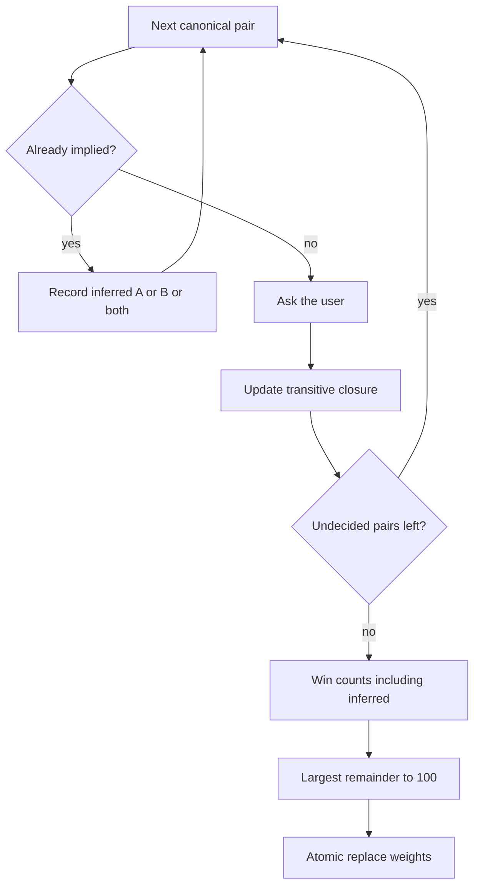

# Pairwise weight questionnaire

## Goal

Let users set comparable-criterion weights by answering pairwise preference questions instead of assigning a 100-point pool by hand. Manual steppers on the Rules tab stay for fine-tuning after.

## Locked product decisions

- **Question:** “What is more important to you?” Answers: **option A**, **option B**, **both**.
- **Candidates:** Unordered pairs of **comparable** criteria, in Rules table order (creation order). Non-comparable criteria are skipped.
- **Skip implied pairs:** Do **not** ask a pair whose outcome is already determined by earlier answers. If A is preferred to B and B is preferred to C, infer A over C — do not ask whether C is more important than A.
- **Scoring:** Every pair still counts, including inferred ones. Winner takes the pair (1 point). **Both** is a tie (1 point each). A criterion that loses every pair can get weight **0**.
- **Apply:** When no undecided pairs remain (the last answer may infer the rest), compute weights, **replace all comparable weights immediately**, close the dialog. No review step.
- **Pool:** Always spend the full **100** points (remaining becomes 0). Integers via largest-remainder rounding.

## Transitivity (do not ask redundant questions)

Preferences are treated as a weak order. Before asking pair `(X, Y)`, compute the closure of answers so far:

- Strict: A preferred to B, B preferred to C → infer **A preferred to C**
- Mix with ties: A preferred to B and B both with C → infer **A preferred to C** (same if A both B and B preferred to C)
- Ties: A both B, B both C → infer **A both C**
- **Not implied:** A preferred to B and C preferred to B → still ask **A vs C** (both beat B; A vs C is new information)

The skipped pair is recorded as that inferred answer so scoring matches a full matrix. Example: user answers A>B and B>C only → infer A>C → scores **2 / 1 / 0** → weights **67 / 33 / 0** (same as asking all three). If we skipped without inferring, it would incorrectly become 50 / 50 / 0.

A cycle is still possible when it is **not** implied (e.g. A>B, C>A, then B vs C). That pair is still asked. Completing a cycle is allowed; winner-takes-pair still produces weights.

Question count is **at most** `n(n-1)/2` and often less (3 criteria can finish in 2 questions). The start button should say **up to N questions**, not a fixed N. In-dialog progress: current question number plus how many comparisons are still undecided (that remaining count can drop by more than one after an answer).

**Back:** Undo the last **asked** (not inferred) answer, recompute closure, and drop inferences that depended on it. The next pair to show is the first canonical pair that is not yet decided.

## Scoring (pure, in `@compy/shared`)

Canonical pair order: all unordered comparable pairs in table order (used both to pick the next question and to iterate for scoring).

Per pair (asked or inferred):

- A preferred → A += 1, B += 0
- B preferred → A += 0, B += 1
- Both → A += 1, B += 1

Then map scores to integers that **sum to 100**:

1. `raw[i] = score[i] / sum(scores) * 100`
2. Give each criterion `floor(raw[i])`
3. Give leftover points to the largest fractional parts; tie-break by table order

Worked examples to lock in tests:

- Two criteria, pick A → **100 / 0**
- Two criteria, both → **50 / 50**
- Three criteria, all both (third inferred) → **34 / 33 / 33**
- A>B then B>C (A>C inferred, not asked) → **67 / 33 / 0**
- A>B and C>B → A vs C is still asked

Guard: fewer than 2 comparable criteria → no questionnaire (button disabled).

## Why a bulk save is required

[`CriteriaService.update`](../../apps/api/src/criteria/criteria.service.ts) rejects a single PATCH if the **temporary** pool would exceed 100. Replacing e.g. `40/40/20` with `100/0/0` cannot be done as three existing PATCHes. The questionnaire must persist **all comparable weights in one transaction**.

## UX

New client dialog (same Radix pattern as [`create-criterion-dialog.tsx`](../../apps/web/components/create-criterion-dialog.tsx)), triggered from [`rules-data-table.tsx`](../../apps/web/components/rules-data-table.tsx) above the table.

- Button: **Set weights with questions**. Disabled when fewer than 2 comparable criteria. Subtitle **Up to N questions**.
- Dialog description: if any comparable weight is already non-zero, say this **replaces current weights**.
- One pair per step: two criterion **names** as A/B, plus **Both**. Skip implied pairs without a flash of a skipped question.
- Progress: `Question 3` and remaining undecided comparisons. **Back** undoes the last asked answer. **Cancel** discards and does not save.
- When the last needed answer is given (remaining undecided becomes 0): compute → bulk save → close → `router.refresh()`. On API error, stay on that last asked question with the alert; answers stay in memory.
- After success, the existing steppers show the new integers (including 0s).

## Implementation

### Shared (source of truth)

Add [`packages/shared/src/pairwise-weights.ts`](../../packages/shared/src/pairwise-weights.ts) and export from [`packages/shared/src/index.ts`](../../packages/shared/src/index.ts):

- `comparablePairs(criteria)` — canonical pair list
- `PairwiseAnswer = 'a' | 'b' | 'both'`
- `inferredAnswer(askedAnswers, pair)` / `nextUndecidedPair(...)` — transitivity including ties
- `completeAnswers(pairs, askedAnswers)` — asked + inferred
- `scoresFromPairwiseAnswers(pairs, answers)`
- `weightsFromScores(scores)` → integers summing to `WEIGHT_POOL_TOTAL`
- `weightsFromPairwiseAnswers(...)` composing the above

Add `ReplaceCriterionWeightsSchema`: every comparable criterion id present, unique, integer weights 0–100, **sum exactly 100**.

### API

- Register `PATCH /comparisons/:comparisonId/criteria/weights` **before** `:criterionId` so `weights` is not captured as an id ([`criteria.controller.ts`](../../apps/api/src/criteria/criteria.controller.ts)).
- [`CriteriaService.replaceWeights`](../../apps/api/src/criteria/criteria.service.ts): load comparable criteria, require the body to cover **exactly those ids**, reject extras/missing/non-comparable, then `prisma.$transaction` updates. Unchanged: names, types, rule configs.

### Web

- Server action `replaceCriterionWeights` next to [`updateCriterionWeight`](../../apps/web/lib/actions.ts).
- New [`apps/web/components/weight-questionnaire-dialog.tsx`](../../apps/web/components/weight-questionnaire-dialog.tsx): asked answers only; next pair from shared inference; no persistence of answers.
- Mount in the Rules table header area.

### Tests (behavior, not UI chrome)

- Shared: transitivity skip (A>B, B>C infers A>C and same weights as three asks); A>B and C>B still needs A vs C; all-ties infers the rest; 2-criterion 100/0; rounding to 100; a non-implied cycle still scores.
- API: happy path, missing id, sum ≠ 100, non-comparable id, pool/transaction.
- Dialog: disabled with 0–1 criteria; implied pair is never shown; one answer can finish the questionnaire; cancel does not save; Back restores the last asked pair and re-asks previously inferred ones if they are undecided again.

When this ships, point to it from the future-extensions list in [`RULES_TAB_FEATURE.md`](../RULES_TAB_FEATURE.md).

## Out of scope

- AHP / intensity scale beyond A vs B vs both
- Saving questionnaire answers
- Changing how `rankEntries` uses weights
- Removing manual steppers
- i18n
